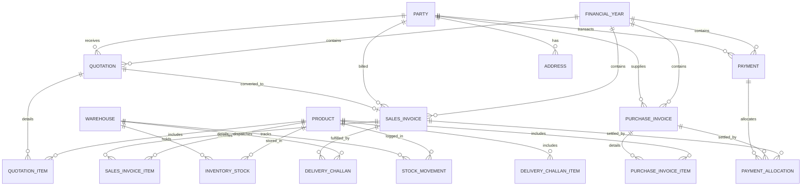

# Database Design & Architecture Document - Dream Decorators ERP

---

## 1. ER Diagram (Mermaid Visualization)



---

## 2. Comprehensive Table Catalog & Specifications

### 2.1 System & Organization
- **`financial_years`**: Defines operational accounting periods (e.g., `FY2026-27`). Prevents back-dated entries once closed.
- **`users`**: RBAC system storing users, password hashes, and user roles (`SUPER_ADMIN`, `ACCOUNTANT`, `SALES_EXECUTIVE`, `INVENTORY_MANAGER`).

### 2.2 Parties (Customers & Vendors)
- **`parties`**: Single normalized model representing Customers, Vendors, or dual-purpose entities (`type = CUSTOMER | VENDOR | BOTH`). Stores GSTIN, credit limits, and opening balances.
- **`addresses`**: One-to-many physical billing & shipping locations per party.

### 2.3 Products & Inventory
- **`products`**: Central catalog of Decorator items (`WINDOW_CURTAINS`, `WINDOW_BLINDS`, `WALLPAPERS`, `MATTRESSES`, `CARPETS`, `SOFAS`). Uses standard Units of Measure (`SQ_FT`, `METERS`, `ROLLS`, `PIECES`).
- **`warehouses`**: Storage facilities or retail branch locations.
- **`inventory_stocks`**: Current physical quantity per warehouse. Unique constraint on `(productId, warehouseId)`.
- **`stock_movements`**: Immutable audit log of all stock increases/decreases (`INWARD_PURCHASE`, `OUTWARD_SALES`, `ADJUSTMENT`).

### 2.4 Commercial Documents
- **`quotations`** / **`quotation_items`**: Pre-sales proposals. Converted to sales invoices upon approval.
- **`sales_invoices`** / **`sales_invoice_items`**: Legal sales transactions. Updates customer debt balance and payment status (`UNPAID`, `PARTIALLY_PAID`, `PAID`).
- **`delivery_challans`** / **`delivery_challan_items`**: Material dispatch notes referencing stock movement from warehouses.
- **`purchase_invoices`** / **`purchase_invoice_items`**: Inward vendor purchases. Automatically triggers inward stock movements.

### 2.5 Payments & Allocation
- **`payments`**: Inbound receipts or outbound payments with payment modes (`CASH`, `BANK_TRANSFER`, `UPI`, `CHEQUE`).
- **`payment_allocations`**: Many-to-many settlement table allocating single payments across multiple sales or purchase invoices.

---

## 3. Performance Optimization Strategy for Millions of Records

1. **Composite & Foreign Key Indexes**:
   - Foreign key fields (`partyId`, `financialYearId`, `productId`, `warehouseId`) are indexed to optimize SQL JOIN execution.
   - Status & type filtering indexes: `@@index([type, isActive])` on `parties`, `@@index([category, isActive])` on `products`.
2. **Numeric Precision**:
   - All currency values stored as `Decimal(14, 2)` (supports amounts up to 999 Billion with exact 2 decimal place accuracy, eliminating floating point rounding bugs).
   - All dimension/quantity figures stored as `Decimal(14, 2)`.
3. **Database Views & SQL Aggregations**:
   - Complex reports (Stock Summary, Outstanding Customer Receivables, Vendor Payables) execute against optimized database views instead of real-time multi-level JOIN scans.

---

## 4. SQL Business Rules & SQL Views (DDL Blueprint)

```sql
-- View: Customer Outstanding Balances
CREATE OR REPLACE VIEW view_customer_outstanding AS
SELECT 
    p.id AS party_id,
    p.code AS party_code,
    p.name AS party_name,
    p.phone,
    COALESCE(SUM(si.grand_total - si.paid_amount), 0.00) AS total_outstanding
FROM parties p
LEFT JOIN sales_invoices si ON p.id = si.party_id AND si.status = 'APPROVED'
WHERE p.type IN ('CUSTOMER', 'BOTH')
GROUP BY p.id, p.code, p.name, p.phone;

-- View: Inventory Valuation & Stock Summary
CREATE OR REPLACE VIEW view_inventory_summary AS
SELECT 
    prod.id AS product_id,
    prod.sku,
    prod.name AS product_name,
    prod.category,
    COALESCE(SUM(st.quantity), 0.00) AS total_stock,
    prod.selling_price,
    (COALESCE(SUM(st.quantity), 0.00) * prod.selling_price) AS inventory_value
FROM products prod
LEFT JOIN inventory_stocks st ON prod.id = st.product_id
GROUP BY prod.id, prod.sku, prod.name, prod.category, prod.selling_price;
```

---

## 5. Future Module Integration Blueprint

- **Payroll & HR**: Will extend the `users` table with an `employee_profiles` child table (Salary structure, Attendance, Department).
- **CRM**: Will extend `quotations` and `parties` with a `leads` and `opportunity_stages` table.
- **Manufacturing**: Will introduce `bill_of_materials` (BOM) and `work_orders` consuming `products` as raw fabric/materials and outputting finished custom curtains/sofas.
